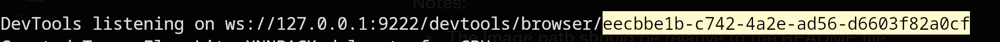

# mark_attendance


### Window
```windows
"C:\Program Files\Google\Chrome\Application\chrome.exe" --remote-debugging-port=9222 --user-data-dir="C:\path\to\remote-profile" --allow-file-access-from-files

/// run it in browser
localhost:9222/version/json
```

### Linux
```linux
/usr/bin/google-chrome-stable --remote-debugging-port=9222 --user-data-dir=remote-profile --allow-file-access-from-files
```

### Mac
```macos
/Applications/Google\ Chrome.app/Contents/MacOS/Google\ Chrome --remote-debugging-port=9222 --no-first-run --no-default-browser-check --user-data-dir=$(mktemp -d -t 'chrome-remote_data_dir')
```



### Copy the code and set it as Env

# Set Up Env
### Linux & Mac
```
export APP_ID=""
```

### Windows
```
$env APP_ID=""
```
